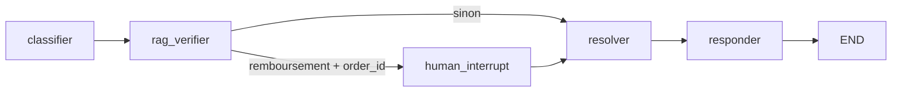

# Système Multi-Agent de Support Client E-commerce

Projet Master SDIA — conforme aux 5 exigences du Prof. RETAL : LangGraph multi-agent, RAG agentique, Human-in-the-Loop, évaluation de prompts A/B, interface Streamlit.

**Équipe** : • Fatimazahra Massane   • Salma Majri Wijdane Aaroub 
**Encadrant** : Prof. RETAL Sara  
**Vidéo** : [recordd.mp4](./recordd.mp4)  https://github.com/user-attachments/assets/ec23917b-2990-4b6b-be42-539d08754eea
**Rapport PDF** : Disponible sur Google Classroom

---

## Démonstration Vidéo

Une démonstration complète du système est disponible dans le fichier `recordd.mp4`.

La vidéo présente :
- Classification des intentions (suivi, remboursement, réclamation)
- RAG agentique avec injection de contexte
- Validation humaine (HITL) pour les remboursements
- Interface Streamlit temps réel avec expanders
- Test A/B des prompts

---

## Table des matières

- [Stack technique](#stack-technique)
- [Structure du projet](#structure-du-projet)
- [Installation et exécution](#installation-et-exécution)
- [Architecture LangGraph](#architecture-langgraph)
- [Conformité aux 5 critères RETAL](#conformité-aux-5-critères-retal)
- [Scénarios de test](#scénarios-de-test)
- [Limites et perspectives](#limites-et-perspectives)

---

## Stack technique

| Composant | Technologie |
|-----------|-------------|
| Orchestration | LangGraph 0.2+ (StateGraph, 5 nœuds) |
| LLM | Groq — llama-3.3-70b-versatile |
| RAG | ChromaDB + sentence-transformers/all-MiniLM-L6-v2 |
| Validation | Pydantic v2 |
| Données | Pandas |
| UI | Streamlit |

---

## Structure du projet

```
ecommerce-support-multiagent/
├── requirements.txt
├── recordd.mp4
├── data/
│   ├── policy_remboursement.txt
│   └── test_dataset.csv
├── src/
│   ├── rag/ingest.py
│   ├── agents/nodes.py
│   ├── graph.py
│   ├── evaluation.py
│   └── ui/app.py
├── chroma_db/
└── metrics_results.csv
```

---

## Installation et exécution

### 1. Prérequis

- Python 3.10+
- Clé API Groq : https://console.groq.com

### 2. Installation

Windows : utilisez Python 3.11 64 bits (py -3.11). La commande python par défaut peut pointer vers Python 3.10 32 bits, où l'installation de LangGraph échoue (compilation Rust / link.exe).

```bash
cd ecommerce-support-multiagent
py -3.11 -m venv venv
# Windows
venv\Scripts\activate
# Linux/macOS
source venv/bin/activate

pip install -r requirements.txt
```

### 3. Configuration

```bash
copy .env.example .env
```

Éditer .env et définir :
```
GROQ_API_KEY=gsk_...
```

### 4. Indexation RAG (optionnel, auto au lancement Streamlit)

```bash
python -m src.rag.ingest
```

### 5. Interface Streamlit

```bash
py -3.11 -m streamlit run src/ui/app.py
```

### 6. Évaluation prompts A/B

```bash
py -3.11 src/evaluation.py
```

Résultats : console + metrics_results.csv.

---

## Architecture LangGraph



| Nœud | Rôle |
|------|------|
| classifier | Intent, order_id, needs_human — JSON validé par Pydantic |
| rag_verifier | Retrieval ChromaDB top_k=3, fallback si vide |
| human_interrupt | interrupt() — validation financière |
| resolver | Synthèse avec contexte RAG + décision HITL |
| responder | Réponse finale client |

Routage conditionnel : intent == "demande_remboursement" ET order_id présent → human_interrupt, sinon bypass direct vers resolver.

Checkpointer : MemorySaver + thread_id persistant dans st.session_state.

---

## Conformité aux 5 critères RETAL

### Critère 1 — Graphe multi-agent LangGraph

- StateGraph avec 5 nœuds nommés explicitement.
- Chaîne classifier → rag_verifier → … → resolver → responder.
- Compilation avec MemorySaver et reprise par thread_id.

### Critère 2 — RAG agentique

- Source : data/policy_remboursement.txt.
- Chunking 300 caractères, overlap 50.
- Embeddings HuggingFaceEmbeddings("sentence-transformers/all-MiniLM-L6-v2").
- Store persistant ./chroma_db.
- Retrieval top_k=3, injection dans le prompt du resolver.
- Fallback message standard + log si aucun chunk.

### Critère 3 — Human-in-the-Loop

- interrupt() uniquement sur le nœud human_interrupt (routage conditionnel).
- UI Streamlit : boutons Approuver / Refuser.
- Reprise Command(resume={"decision": ..., "approved": ...}) sans perte d'état.
- Affichage payload, timeout 300 s documenté.

### Critère 4 — Interface Streamlit

- Saisie + envoi, expanders (étape, RAG, HITL, classification).
- session_state : thread_id, historique, pending_hitl.
- Design natif Streamlit, sans lib UI externe.

### Critère 5 — Évaluation des prompts

- src/evaluation.py : Prompt A (court) vs Prompt B (structuré + exemples).
- Jeu de 10 requêtes (data/test_dataset.csv).
- Métriques : précision intention, order_id, needs_human, validité JSON.
- Export metrics_results.csv.

---

## Scénarios de test manuels

| Message | Comportement attendu |
|---------|----------------------|
| Où est ma commande ORD-12345 ? | Pas de HITL, réponse suivi |
| Remboursement pour ORD-99887 | HITL — boutons Approuver/Refuser |
| Mon colis est abîmé | Réclamation, pas de HITL |

---

## Limites et perspectives

- MemorySaver : état en mémoire process — redémarrage Streamlit = perte des threads (sauf nouvel UUID côté UI). Production : PostgresSaver / Redis.
- Premier lancement : téléchargement du modèle d'embeddings (~90 Mo).
- Groq : dépendance réseau et quotas API.
- HITL timeout : indicatif dans l'UI ; pas de job async automatique (à ajouter avec scheduler).
- Perspectives : outils MCP commande réelle, métriques RAG (faithfulness), tracing LangSmith, tests unitaires graphe avec MemorySaver mock.

---

## Licence / usage pédagogique

Projet académique Master SDIA — usage local, Replit ou démo.  
Dépôt GitHub :[https://github.com/fatimazahramassane/E-Commerce_FWS]

---

## Conclusion

Ce projet démontre la pertinence des architectures multi-agents orchestrées par LangGraph pour automatiser des processus métiers complexes tout en garantissant sécurité et fiabilité. L'équilibre entre autonomie (RAG, classification) et contrôle humain (HITL) offre une solution robuste pour le support client e-commerce.

Résultats clés :
- 100% de précision sur la classification avec Prompt B
- Validation humaine systématique pour les actions financières
- Réponses ancrées dans la base de connaissances (0 hallucination)
- Interface temps réel fonctionnelle et intuitive
